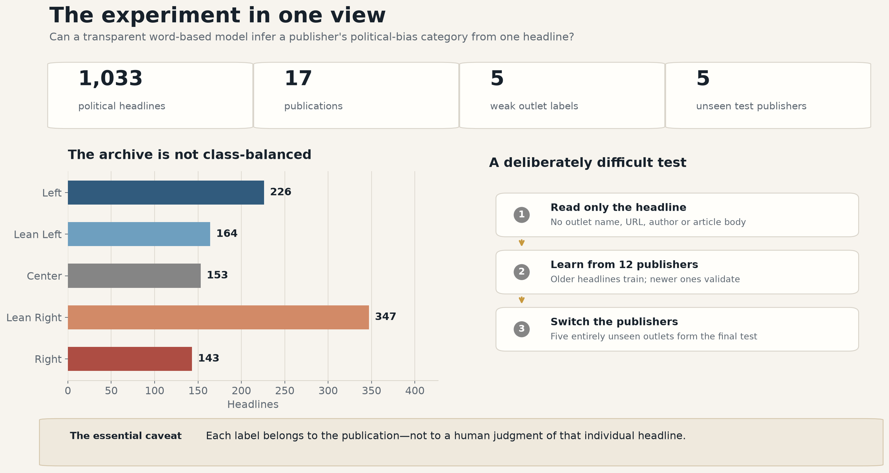
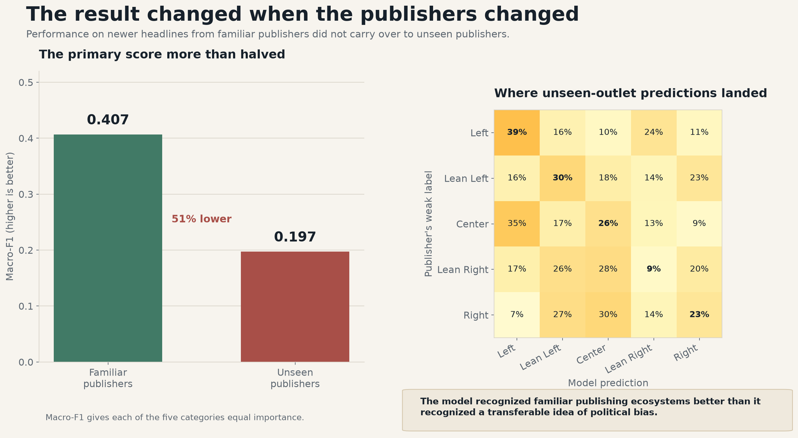
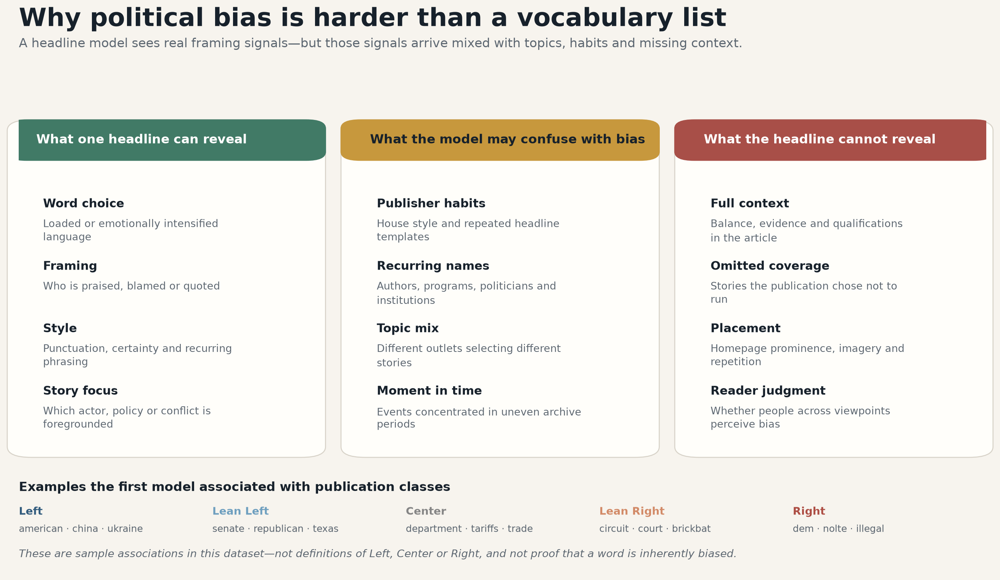

# Why political bias is more complex than you think

### An interpretable experiment with political headlines, publication labels and an intentionally difficult test

Can a model read a political headline and identify whether it came from a publication rated **Left,
Lean Left, Center, Lean Right or Right**?

At first glance, this looks like an ordinary text-classification problem. The experiment shows why it
is not. A model can learn meaningful differences in wording, framing and story focus—but it can also
learn publisher habits, recurring names, topic preferences and the news cycle. When the publishers
changed, the model's primary score fell by roughly half.

That gap is the central finding of this project. It is also the reason political bias should not be
reduced to a list of partisan words.



## The question this project actually answers

The current model asks:

> Given only a political headline, which AllSides-rated kind of publication is its language and
> content most consistent with?

It does **not** establish whether that individual headline is objectively Left, Center or Right.
Every training label is inherited from the publication's AllSides rating. No person independently
annotated the headline itself.

This distinction matters because publication ratings summarize much more than one sentence. They can
reflect story selection, editorial patterns, article framing, imagery and coverage over time. A model
that sees one headline cannot observe most of that context.

The project therefore uses the term **publication-proxy model**. It predicts an outlet-associated
category from headline text; it is not presented as a general detector of truth, credibility,
fairness or individual-headline bias.

## The dataset

The current snapshot contains **1,033 political headlines from 17 publications** across five weak
outlet labels:

| Weak publication label | Headlines |
|---|---:|
| Left | 226 |
| Lean Left | 164 |
| Center | 153 |
| Lean Right | 347 |
| Right | 143 |

Headlines were collected from first-party publisher feeds and archive pages. A deterministic topic
gate excludes shopping, product deals, gifts, lifestyle, entertainment, sports and travel from the
model-ready dataset. The upstream archive remains intact so filtering decisions can be reproduced.

The first model uses **headline text only**. RSS descriptions are preserved as `feed_summary`, but
they are not treated as true subheadlines because publishers use that field inconsistently.

The full data definition, provenance fields and quality limitations are documented in the
[dataset card](DATASET_CARD.md). The outlet registry and rating snapshots are in
[config/outlets.csv](config/outlets.csv).

## A test designed to expose shortcuts

A random row split would allow headlines from every publication to appear on both sides of the
experiment. That setup makes it easy for a model to recognize a familiar publisher's vocabulary and
mistake that recognition for general political understanding.

Instead, the data has three roles:

| Role | Records | Purpose |
|---|---:|---|
| Training | 419 | Older headlines from 12 non-holdout publications |
| Validation | 118 | Newer headlines from those same publications |
| Unseen-publication test | 496 | All headlines from five entirely held-out publications |

One publication per class is held out. No outlet or exact normalized headline crosses from
development into the unseen-publication test. The split manifest is versioned at
[data/splits/pilot_v1.csv](data/splits/pilot_v1.csv).

## The first result



The first transparent word-based model performed substantially better on newer headlines from
familiar publishers than on headlines from unseen publishers:

| Evaluation | Macro-F1 | Accuracy | Ordinal error | Within one class |
|---|---:|---:|---:|---:|
| Familiar publishers, newer headlines | 0.407 | 0.407 | 1.136 | 0.678 |
| Unseen publishers | 0.197 | 0.220 | 1.510 | 0.548 |

**Macro-F1** gives each category equal importance. **Ordinal error** measures how many steps a
prediction traveled on the ordered Left-to-Right scale. “Within one class” counts both exact and
adjacent predictions.

The unseen-publication macro-F1 is about **51% lower** than the familiar-publication result. Lean
Right was especially difficult to transfer: only 9% of its held-out examples were predicted as Lean
Right, despite that class having the largest test support.

The most defensible interpretation is not that the model “failed to understand politics.” It is that
the easier experiment and the harder experiment measure different things:

- On familiar publishers, the model can exploit recurring editorial ecosystems.
- On unseen publishers, it must transfer whatever broader framing patterns it learned.
- The large gap shows that these are not interchangeable abilities.

## What the model appears to learn



Because the model is linear and word-based, every prediction can be decomposed into visible word
contributions. Its strongest associations included plausible political and framing signals, but also
function words, recurring series names and author-like tokens.

For example, the learned associations included terms such as `tariffs`, `court`, `senate` and
`illegal`, alongside tokens such as `brickbat` and `nolte`. Those latter terms are warning signs: the
model may be recognizing a recurring publisher feature rather than an ideological principle.

These coefficients are **dataset-specific associations**, not definitions of Left or Right. A word
can appear because of topic selection, a particular event, a repeated column or the outlets included
in this snapshot. Treating the resulting feature list as a universal bias dictionary would repeat the
same conceptual mistake the experiment is meant to reveal.

## What this result supports—and what it does not

| Supported by this experiment | Not supported by this experiment |
|---|---|
| Headline language contains some outlet-associated signal | The model objectively measures an individual headline's bias |
| Familiar-publisher evaluation can substantially overstate transfer | Center predictions are more factual or reliable |
| Visible coefficients can reveal publisher and topic shortcuts | A strongly weighted word is inherently ideological |
| Unseen-publisher testing changes the scientific conclusion | The current score generalizes to all news organizations or future events |

AllSides ratings concern media bias, not factual accuracy. This project likewise makes no credibility
or truthfulness judgment about a publication or headline.

## Limitations

This is a deliberately honest pilot, not a final benchmark.

- **The target is weak.** Publication labels are not independent headline-level judgments.
- **The dataset is small.** Only two or three development publications represent each class.
- **Publisher contribution is uneven.** The natural archive is intentionally retained rather than
  balanced by discarding records.
- **Time and topic are confounded.** Feed depth and archive periods differ between publishers.
- **Event control is incomplete.** Exact duplicates are isolated, but near-duplicate and
  same-event headlines are not yet clustered.
- **Opinion and news can still mix.** The political filter removes irrelevant topics but cannot
  perfectly identify every editorial format.
- **Probabilities are uncalibrated.** They must not be interpreted as reliable confidence values.
- **The OOD test has now been observed.** Future model selection should use development data only,
  followed by a newly collected prospective test.

For a genuine claim about bias in individual headlines, the project would ultimately need a blinded,
independently annotated benchmark. That is outside the current no-human-annotation design.

## Read the experiment cell by cell

The development process is organized as five executed notebooks. Their outputs are retained so the
current result can be inspected without rerunning anything.

1. [Data audit](notebooks/01_data_audit.ipynb) — class balance, publications, dates and text fields.
2. [Split design](notebooks/02_split_design.ipynb) — chronological validation and publisher holdouts.
3. [Interpretable baselines](notebooks/03_interpretable_baselines.ipynb) — trivial baseline versus two word models.
4. [Feature interpretation](notebooks/04_feature_interpretation.ipynb) — class coefficients and one decomposed prediction.
5. [Error analysis](notebooks/05_error_analysis.ipynb) — the frozen unseen-publication result and its mistakes.

Notebook cells are intentionally small; the largest current code cell is 14 lines. Reusable logic
lives in [src/bias_dataset/modeling.py](src/bias_dataset/modeling.py) so leakage checks and metrics can
be tested independently of Jupyter.

## Reproduce the project

The collector itself uses the Python standard library. Modeling dependencies are pinned separately.

```bash
python3.12 -m venv .venv
.venv/bin/python -m pip install -r requirements-modeling.txt
PYTHONPATH=src .venv/bin/python -m unittest discover -s tests -v
.venv/bin/jupyter lab
```

Run the numbered notebooks in order. To rebuild the three README dashboards from the saved results:

```bash
MPLCONFIGDIR=.matplotlib-cache .venv/bin/python scripts/build_article_dashboards.py
```

To collect and rebuild a fresh politics-only dataset:

```bash
PYTHONPATH=src python3 -m bias_dataset.collect
PYTHONPATH=src python3 -m bias_dataset.build
```

Generated raw data and model artifacts are ignored by Git because they can grow substantially. The
source registry, processing logic, split manifest, notebook source and editorial dashboards remain
reproducible from the project files.

## Project map

```text
config/outlets.csv                  publication labels and first-party feeds
data/processed/                     model-ready politics-only snapshot
data/splits/pilot_v1.csv            frozen record-level split manifest
notebooks/01...05                   executed experimental narrative
src/bias_dataset/                   collection, filtering and modeling logic
tests/                              data, leakage and model tests
reports/figures/                    three article-facing dashboards
reports/modeling/                   generated metrics and predictions
MODEL_CARD.md                       exact first-model configuration and results
DATASET_CARD.md                     dataset semantics, quality and limitations
deep-research-report.md             full methodological research plan
```

## Next steps

The next phase should improve the experiment without optimizing against the observed OOD result:

1. expand publication diversity within every class;
2. collect a broader and more consistent time window;
3. add near-duplicate and same-event grouping before splitting;
4. mask named entities, branded series and source tokens as shortcut diagnostics;
5. compare character features and alternative transparent linear classifiers on development data;
6. freeze a genuinely new future/outlet test after model selection;
7. compare the natural topic distribution with an event-matched evaluation set.

The detailed rationale is in [deep-research-report.md](deep-research-report.md), and the exact current
model boundary is summarized in [MODEL_CARD.md](MODEL_CARD.md).

## Responsible use and attribution

This project is intended for research, education and critical discussion of media-bias measurement.
It should not be used to rank the factual reliability of outlets, label individuals, moderate speech
or make high-stakes decisions.

The weak labels are derived from attributed AllSides publication-rating snapshots. Review AllSides'
current terms and obtain any required permission before commercial use. Publisher headlines retain
their source URLs and acquisition provenance in the generated dataset.
