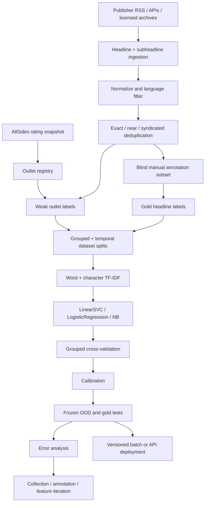

# Designing a TF‑IDF System for Five-Class Media-Bias Prediction from News Headlines and Subheadlines

## Executive summary

A TF‑IDF classifier for the five AllSides categories—**Left, Lean Left, Center, Lean Right, Right**—is technically straightforward. The hard part is not TF‑IDF. It is constructing a target variable that means what you think it means.

AllSides assigns its standard Media Bias Ratings primarily to **media outlets or writers**, not to individual headlines. Its current methodology combines multi-partisan editorial reviews, blind bias surveys, independent reviews, and occasionally third-party research. Editorial reviewers may inspect an outlet's homepage, headlines, articles, photographs, story choice, slant, spin, and sensationalism over a period reaching roughly six months. AllSides then assigns the outlet a categorical rating and a numerical score from −6 to +6. AllSides explicitly says that its methodology uses multiple human-centered methods rather than an algorithm.

That creates an important distinction:

> **An AllSides outlet label attached to every headline from that outlet is a weak label for the headline, not a genuine headline-level bias annotation.**

AllSides itself illustrates the distinction in an Apple News analysis: it assigned articles the overall rating of their publisher and explicitly noted that it was **not evaluating the content of each article itself**.

Therefore, the project should ideally contain two related experiments:

| Track | Question the model actually answers | Labels |
|---|---|---|
| **Outlet-proxy model** | “Given only this headline/subheadline, which AllSides-rated kind of outlet is it stylistically/content-wise most consistent with?” | AllSides outlet rating inherited by articles |
| **Headline-bias model** | “How would this particular headline/subheadline itself be rated on an AllSides-style five-point ideological scale?” | Manually annotated headline-level gold labels |

The first can be built relatively cheaply with tens of thousands of headlines. The second is the scientifically stronger interpretation of your stated goal, but it requires a manually rated gold set—or appropriately licensed article-level ratings—because outlet labels alone cannot provide article-level ground truth. AllSides now also advertises bias-rating and bias-checker API products, which are worth investigating if article-level use or commercial deployment is intended.

The most serious methodological error would be to scrape, say, 10,000 CNN headlines and 10,000 Fox headlines, assign CNN's AllSides label to every CNN article and Fox's label to every Fox article, randomly split all headlines 80/20, obtain an apparently impressive F1 score, and conclude that the model detects headline bias. Such a model can exploit outlet-specific vocabulary, recurring beats, politicians covered, syndicated material, formatting conventions, and time-specific topics. It may mainly be an **outlet fingerprint detector**.

The experiment therefore needs **outlet-grouped and temporal holdouts**, not merely a random article split. Scikit-learn explicitly recommends grouped cross-validation when multiple observations from the same underlying group are dependent; `GroupKFold` keeps a group entirely out of either train or test, while `StratifiedGroupKFold` additionally attempts to preserve class balance.

A defensible initial target is:

**Pilot weak dataset:** approximately **2,000–5,000 unique headlines per class**, or 10,000–25,000 total.

**Serious weak-supervision baseline:** approximately **10,000–20,000 per class**, or 50,000–100,000 total, collected across preferably **8–12 genuinely distinct outlets per class**, multiple topics and several months.

**Gold headline-level evaluation dataset:** initially **500–1,000 manually labelled records per class**, or 2,500–5,000 total, preferably with at least three independent annotations followed by adjudication.

These are engineering starting points, not scientifically universal sample-size thresholds. The correct final size is an **open parameter** that should be determined through learning curves, class-specific uncertainty, outlet diversity, annotation agreement, and the desired width of confidence intervals.

The recommended first modelling stack is:

```text
headline + subheadline
        ↓
cleaning / deduplication / language filtering
        ↓
word TF-IDF (1–2 grams)
        +
character TF-IDF (3–5 or 3–6 grams)
        ↓
LinearSVC / LogisticRegression / ComplementNB
        ↓
probability calibration if needed
        ↓
five AllSides-style classes
```

`LinearSVC` and logistic regression should be the main contenders because scikit-learn supports sparse inputs directly for these estimators; `LinearSVC` implements multiclass classification using one-vs-rest. Multinomial Naive Bayes is a very cheap baseline and scikit-learn explicitly notes that TF‑IDF fractional values can work with it; Complement Naive Bayes is specifically designed to perform better under imbalance.

The project's primary metric should be **macro-F1 on a frozen out-of-outlet test set**, accompanied by per-class precision/recall/F1, normalized confusion matrices, calibration measurements, and an ordinal error measure that distinguishes a one-step error such as `Center → Lean Right` from a four-step error such as `Left → Right`. Scikit-learn supports macro multiclass ROC-AUC, one-vs-rest ROC calculations, average precision for precision-recall analysis, and weighted Cohen's kappa, including quadratic weighting.

The expected end-to-end design is:



The central recommendation is ruthless but simple: **build TF‑IDF last, build the evaluation design first**. A mediocre classifier evaluated correctly is scientifically useful; a high-scoring classifier evaluated on leaked outlet fingerprints is not.

## What “AllSides-style bias” should mean in this project

AllSides currently maps its numerical Bias Meter into the five classes as follows: **Left −6.00 to −3.00, Lean Left −2.99 to −1.00, Center −0.99 to +0.99, Lean Right +1.00 to +2.99, and Right +3.00 to +6.00**. It describes these ratings as reflecting an average judgment incorporating ordinary Americans and experts across the political spectrum.

That five-class structure is convenient for machine learning, but the categories are also **ordered**:

```text
Left < Lean Left < Center < Lean Right < Right
 -2       -1         0          +1        +2
```

You should therefore store both the categorical label and, where available, AllSides' continuous Bias Meter value. The classifier can still make one of five predictions, but the numeric ordering makes better error analysis possible. A `Left → Lean Left` mistake should not be treated as substantively equivalent to `Left → Right`. Weighted Cohen's kappa supports linear or quadratic weighting and is therefore useful as a secondary metric.

More importantly, AllSides' concept is broader than linguistic wording. Its editorial review process examines **slant, spin, sensationalism, story choice**, headlines, full articles, photos, homepages, and content spanning months. Blind Bias Surveys expose people to headlines and articles with identifying information removed and aggregate judgments across political groups.

A TF‑IDF model receiving one headline and one subheadline cannot observe several of those phenomena:

| AllSides-relevant signal | Observable from one headline? |
|---|---:|
| Loaded word choice | Yes |
| Framing/slant in headline | Partly |
| Sensationalism | Often |
| Which actors are praised/blamed | Often |
| Negation and modality | Often |
| Article's complete balance/context | No |
| Story choice relative to stories the outlet ignored | No |
| Homepage prominence | No |
| Photographic framing | No |
| Six-month editorial pattern | No |
| Difference between reporting and omitted perspectives | Usually no |

Consequently the system should be described as predicting **“headline-level ideological framing on an AllSides-inspired five-point scale”**, or, under weak supervision, **“the AllSides outlet class associated with the linguistic/content patterns of a headline.”** It should not be marketed as reproducing AllSides' full methodology. AllSides itself emphasizes that its ratings do not measure factual accuracy or credibility, so your output should likewise not imply “Right = less factual” or “Center = more reliable.”

### A two-layer label architecture

Use at least two separate label columns:

```text
weak_outlet_label
gold_headline_label
```

For example:

```text
headline:
"Senate Democrats push sweeping new climate package"

weak_outlet_label:
"Lean Left"       # inherited from the publisher

gold_headline_label:
"Center"          # hypothetical result from blind human annotation
```

That discrepancy is not an error. It is exactly what you should expect if outlet-level ideology and headline-level framing are different constructs. AllSides' own Apple News methodology explicitly provides precedent for distinguishing outlet-level attribution from content-level evaluation.

You can then report four evaluations:

| Experiment | Training label | Test label | What it diagnoses |
|---|---|---|---|
| Weak → weak, seen outlets | Outlet | Outlet | Easy baseline; prone to fingerprint learning |
| Weak → weak, unseen outlets | Outlet | Outlet | Whether linguistic patterns generalize across outlets |
| Weak → gold headlines | Outlet | Human headline | How well weak supervision transfers to actual headline bias |
| Gold → gold | Human headline | Human headline | Cleanest estimate of headline-bias classification |

The **third and fourth rows should determine whether the project succeeds**. The first row is mostly a sanity check.

### Manual annotation should imitate the useful parts of AllSides, not blindly copy it

AllSides' editorial panels include people across left, center and right perspectives, while its Blind Bias Surveys remove identifying source information before participants rate content. Your gold-label procedure should borrow those principles.

Hide source name, URL, logo, author and page styling from annotators. Give them only:

```text
Headline:
...

Subheadline:
...
```

Recruit, where feasible, annotators with a spread of self-described political viewpoints. For a research-quality gold set, use **three independent annotators per headline**, with a fourth/adjudicator for disputed cases. Three is an engineering recommendation rather than an AllSides requirement; AllSides' full editorial review itself typically uses six to nine reviewers, while some smaller reviews use three.

The annotation manual should ask raters to judge observable headline properties such as loaded wording, asymmetric characterization, praise/blame, emotional intensification, political assumptions presented as obvious, selective quoting, and ideological framing. Do **not** ask them to infer bias from the publisher or from assumptions about its audience.

A useful annotation form is:

```json
{
  "left": 0,
  "lean_left": 1,
  "center": 1,
  "lean_right": 1,
  "right": 0,
  "confidence": 2,
  "flags": [
    "insufficient_context"
  ]
}
```

After three annotators, preserve the full distribution rather than immediately destroying disagreement:

```json
{
  "annotator_distribution": {
    "Left": 0.0,
    "Lean Left": 0.333,
    "Center": 0.333,
    "Lean Right": 0.333,
    "Right": 0.0
  },
  "adjudicated_label": null,
  "ambiguous": true
}
```

For the five-class training target, highly ambiguous cases can either be adjudicated or excluded from the first gold model. **Do not automatically turn disagreement into Center.** “Raters disagree about whether this is Left or Right” is fundamentally different from “raters agree that this headline is Center.”

Likewise, avoid using partisan-keyword heuristics as ground truth—for example, assigning “Left” to headlines containing `climate justice` and “Right” to headlines containing `border invasion`. Doing so creates circularity: TF‑IDF will rediscover the keywords you used to define the labels, producing impressive but meaningless performance. Heuristics are suitable for **sampling and active learning**, not gold labels.

## Data acquisition, source selection, legality, and ethics

The data pipeline needs two independent ingredients:

```text
AllSides        → outlet rating / rating metadata
News publishers → individual headline/subheadline records
```

Do not make AllSides responsible for both unless you have explicit licensing for the exact data you use.

### Creating the outlet registry

As of August 2026, AllSides says its chart is backed by more than 2,400 media-bias ratings. It also sometimes publishes separate ratings for news and opinion content. Build an outlet registry before collecting articles, with columns such as:

```text
source_id
source_name
domain
allsides_class
allsides_meter
allsides_confidence
rating_scope
rating_methods
rating_checked_at
rating_page
```

The `rating_scope` field is critical. CNN Digital's current AllSides page, for example, explicitly says its rating is for its online written news and not its television or opinion/editorial content. The Wall Street Journal similarly has a specifically identified news rating. Mixing separately rated opinion sections into “news” will inject avoidable label noise.

Ratings can also change. Vox, for example, had a 2026 Blind Bias Survey average in Lean Left territory but retained an overall Left rating after further review, illustrating why you need to snapshot both the current category and the evidence/date behind it.

An illustrative starting source panel, to be **revalidated immediately before collection**, could look like this:

| Class | Illustrative outlets for online written material | Current-rating evidence |
|---|---|---|
| **Left** | HuffPost, Vox, The Atlantic, Mother Jones | HuffPost is currently Left; Vox retained Left after a 2026 review; The Atlantic's 2025 survey confirmed Left. |
| **Lean Left** | CNN Digital, NBC News Digital, ABC News Online, Newsweek/Mediaite | CNN, NBC and ABC currently have Lean Left online-news ratings. |
| **Center** | Reuters, Wall Street Journal News, NewsNation, The Hill | Reuters, WSJ News and NewsNation are currently Center; The Hill is also rated Center. |
| **Lean Right** | Washington Examiner, Daily Mail, The Epoch Times, The Dispatch, Reason, The Free Press | Current AllSides pages classify these examples in Lean Right; confidence varies by source. |
| **Right** | Fox News Digital, The Daily Wire, Newsmax, Breitbart | Current pages place these outlets in Right. |

That is a **sampling frame, not a definitive permanent list**. The registry should be regenerated or manually reviewed on every major dataset release because using a 2023 label to describe 2026 content can silently corrupt the target.

Also resist the temptation to use exactly one or two famous outlets for each category. With only CNN representing Lean Left and Fox representing Right, “bias detection” and “CNN-versus-Fox detection” become practically inseparable.

### Acquisition hierarchy

Prefer collection methods approximately in this order:

**Publisher-provided RSS/Atom feeds or documented APIs → licensed news-data APIs/archives → sitemaps where permitted → direct HTML crawling only when necessary and allowed.**

Media Cloud currently documents an online-news archive containing more than 200 million stories and offers search interfaces, making it potentially useful for research-scale source and headline retrieval. GDELT is another large-scale source; it monitors web, print and broadcast news across more than 100 languages and provides a continually updated open platform.

NewsAPI is technically convenient, but licensing matters: its free Developer plan is explicitly restricted to development/testing and cannot be used in staging or production. This is a good example of why “there is an API” is not the same as “the data may be used however you like.”

Common Crawl can be useful for historical recovery, but it should not be treated as a magic copyright exemption. Common Crawl says its crawler identifies itself, honors `robots.txt`, and responds to removal requests.

### Research update: the recommended collection architecture (August 2026)

The optimal approach is **prospective first-party capture plus archive-assisted backfill**, followed by separate weak and gold labelling. No single aggregator is complete enough, stable enough or rich enough in subheadlines to serve as the sole source.

Use this order of responsibility:

```text
AllSides licensed CSV/API       → versioned outlet registry and weak labels
Publisher RSS/Atom/API          → primary prospective article discovery
Permitted publisher metadata    → headline, subheadline and revision capture
Media Cloud                     → historical backfill and coverage audit
GDELT                           → gap discovery and cross-outlet event matching
Human annotation               → gold headline-level labels
```

#### Why this is the best practical combination

1. **Obtain the outlet registry directly from AllSides if possible.** AllSides now offers a ratings license/API covering roughly 2,400 ratings, while its terms allow attributed noncommercial research use but require permission for commercial use. A supplied CSV/API is more reproducible than scraping mutable rating pages. Snapshot the received file, retrieval date, rating scope, confidence and numerical meter; never silently relabel old articles when a rating changes. [AllSides ratings license/API](https://www.allsides.com/tools-services/bias-ratings-license-api) and [AllSides terms](https://www.allsides.com/terms-of-use).

2. **Make official publisher feeds the prospective source of truth.** Poll every enabled feed on a fixed schedule and retain the unmodified response plus retrieval time. This is also the principal collection strategy used by Media Cloud, supplemented there with sitemaps. Feeds preserve discovery order and are less likely than search APIs to introduce relevance-ranking bias. [Media Cloud FAQ](https://www.mediacloud.org/documentation/faqs).

3. **Fetch a publisher page only when allowed and only for missing metadata.** Extract in a documented precedence order: publisher API/feed fields, `NewsArticle` JSON-LD (`headline`, `alternativeHeadline`, `datePublished`, `dateModified`), then explicitly mapped Open Graph or outlet-specific selectors. Store the value and its extraction method separately. Schema.org defines `alternativeHeadline` as a secondary title, but publishers use metadata inconsistently, so `subheadline_missing=true` must remain distinct from an empty subheadline. [Schema.org NewsArticle](https://schema.org/NewsArticle).

4. **Preserve headline versions.** Never overwrite a headline after a page update. Store `(canonical_url, observed_at, headline, subheadline, content_hash)` and derive a separate current-record view. This matters because the MediaSpin study found 78,910 post-publication headline pairs and treats edits themselves as a meaningful source of framing and bias variation. [MediaSpin dataset paper](https://ojs.aaai.org/index.php/ICWSM/article/view/42794).

5. **Use Media Cloud for backfill and coverage auditing, not as the only collector.** Its story records expose a stable story ID, cleaned title, resolved URL, source, language and dates; its downloadable API does not provide story text. Its documented default quota is 4,000 requests per week—enough to page through roughly four million stories—so it is well suited to checking which outlet-days the feed collector missed. [Media Cloud story schema](https://www.mediacloud.org/documentation/story-guide) and [quota/access notes](https://www.mediacloud.org/documentation/faqs).

6. **Use GDELT as a discovery and event-matching layer.** Query exact domains in narrow time windows, then use returned URLs to detect missing coverage and build cross-outlet event clusters. Do not treat its article-list output as a complete sample: the documented endpoint returns at most 250 results per query and can rank by relevance/popularity. [GDELT DOC 2.0 documentation](https://blog.gdeltproject.org/gdelt-doc-2-0-api-debuts/).

7. **Use Common Crawl only for targeted recovery.** Query its URL index for already identified outlet/date gaps and fetch only the required WARC ranges. It is too large and extraction-heavy to be the default pipeline, but its WARC, WAT and WET layers make it a useful last-resort archive. [Common Crawl data formats](https://commoncrawl.org/get-started).

#### Collection design that avoids bias before modelling

Capture exhaustively within the chosen outlets and dates; **balance only when creating a dataset release**, not during ingestion. Keep two derived samples:

```text
natural sample        preserves real outlet topic/story-choice frequencies
event-matched sample  holds events and time approximately constant across classes
```

Start with 10 outlets per class, selected for rating confidence, correct news/opinion scope, feed availability and consistent metadata—not fame. Collect continuously for 12 months. Cap no outlet at ingestion; for training, cap each outlet at 20% of its class and use a `class × outlet × month × topic` sampling grid. Hold back at least one outlet per class and the final 8–12 weeks from the beginning so the test sets cannot be contaminated later.

Assign `event_id` before sampling and splitting. Cluster records within a narrow time window using named entities plus semantic similarity, then manually audit a sample of clusters. This enables comparable-event evaluation and prevents versions or syndicated coverage of the same story from crossing train and test.

#### Gold-label strategy

Outlet labels should remain `weak_outlet_label`; they must not become the claimed truth for individual headlines. Build the first gold set from 2,500 blinded headlines (500 per class after adjudication), with three independent human judgments per item and an adjudicator for disagreement. Oversample event-matched records, unseen outlets, low-confidence weak labels and examples on which preliminary models disagree, but retain sampling weights so aggregate estimates can be corrected.

Existing datasets are useful for annotation design and auxiliary pretraining, but should not be merged blindly into the five-class target. BABE contains 3,700 expert-labelled sentences balanced across topics and outlets; Baly et al. provide 34,737 manually annotated articles balanced across topics and media and explicitly test on unseen outlets. Those findings support expert/blinded annotation, topic control and outlet-disjoint evaluation, but their label units and class schemes differ from this project's headline-level five-way target. [BABE paper](https://aclanthology.org/2021.findings-emnlp.101/) and [Baly et al. paper](https://aclanthology.org/2020.emnlp-main.404/).

Do not use the AllSides Bias Checker API as gold ground truth: it is an AI-enhanced estimate. It can be used as one weak teacher or to select disagreements for human review, provided its output is stored in a separate field and never appears in the gold test-label process. [AllSides Bias Checker](https://www.allsides.com/bias-checker).

#### Operational quality gates

Block a dataset release if any of these fail:

- every record has acquisition source, retrieval timestamp, canonical URL and immutable raw provenance;
- rating scope and rating snapshot exist for every outlet/date interval;
- per-outlet/day feed gaps and title/subheadline missingness are reported;
- exact, near-duplicate, revision-family and syndication identifiers are computed globally;
- language and news-versus-opinion filters are manually audited by outlet;
- no `event_id`, canonical URL or revision family crosses a split;
- frozen unseen-outlet, future-time and gold test sets remain untouched by feature or threshold decisions.

This yields three assets rather than one muddled table: an immutable headline archive, a large weakly labelled training set, and a smaller independently annotated gold benchmark. That separation is the most important design choice for a future model.

### Per-source collection procedure

For every outlet:

1. Snapshot the current AllSides rating and rating scope.
2. Check publisher terms, API/feed conditions and `robots.txt`.
3. Prefer an official feed/API.
4. Collect only fields needed for this task rather than full article bodies.
5. Rate-limit requests, cache pages, identify your crawler where direct crawling is allowed, and avoid paywall circumvention.
6. Record acquisition provenance and terms/robots check dates.
7. Re-run a deduplication layer across **all** outlets rather than within each outlet only.

RFC 9309 defines the Robots Exclusion Protocol as a mechanism for site owners to communicate how automated clients should access their URI space. Crucially, the RFC also says robots rules are **not a form of access authorization**; robots compliance therefore complements, rather than replaces, terms/licensing analysis.

### Sampling plan

Do not simply download the latest N stories from each source. That will confound bias with time, topic and publication frequency.

For a first strong weak-label dataset, target approximately:

| Requirement | Pilot | Stronger baseline |
|---|---:|---:|
| Headlines per class | 2k–5k | 10k–20k |
| Total headlines | 10k–25k | 50k–100k |
| Distinct outlets/class | ≥5 preferred | 8–12 preferred |
| Collection period | ≥3 months | 6–12+ months |
| Gold labels/class | 250–500 initially | 500–1,000+ |
| Human judgments with 3 raters | 3,750–7,500 | 7,500–15,000+ |

These are project-planning targets, not externally established statistical thresholds. The final target should remain open-ended until learning curves show whether additional data materially improves out-of-outlet macro-F1.

Sample across **time and topic**. A useful collection grid is:

```text
bias_class × outlet × month × topic
```

Rather than:

```text
bias_class only
```

For example, if almost all Right headlines happen to come from an election month while Center headlines come from a quieter month, the model will learn election vocabulary.

Where possible, build explicit topical strata:

```text
US politics
economy
immigration
climate/energy
health
foreign policy
crime
education
technology
culture
other
```

The target should be political bias, not “which classes cover immigration more often.” That said, AllSides explicitly considers **story choice** part of outlet bias. This creates a design choice you should make explicitly:

```text
Model A — natural editorial distribution
    Preserve each outlet's real topic distribution.
    Captures topic/story-choice effects.

Model B — topic-controlled
    Match topic/event distributions across classes.
    Better isolates linguistic/framing effects.
```

Run **both**. Their performance difference is valuable scientific information.

An especially strong variant is an **event-matched evaluation set**: for the same major event, collect headlines from Left, Lean Left, Center, Lean Right and Right publishers. The event is then approximately constant while headline framing changes. This attacks one of the largest confounds in the project.

### Copyright and data protection

AllSides' current Terms state that its Media Bias Ratings are licensed under **Creative Commons Attribution-NonCommercial 4.0** and may be used for research or noncommercial purposes with attribution; commercial use requires prior written consent, and AllSides directs users seeking commercial use or CSV/JSON ratings to contact it. If there is any realistic possibility that the classifier becomes a paid API, company product or commercial feature, solve this licensing question before building dependency on the ratings.

For publisher headlines, the legal position is jurisdiction- and use-specific. The U.S. Copyright Office states that names, titles, slogans and short phrases are not protected by copyright as such. That does **not** provide a blanket authorization for automated access, databases of larger subheadings, contractual restrictions, trademark issues, or uses governed by other jurisdictions.

Within the EU, the Digital Single Market Directive includes text-and-data-mining provisions concerning reproduction/extraction of lawfully accessible works; the legal framework also includes circumstances in which rights holders may reserve rights, so applicability depends on the particular TDM exception, access status, national implementation, and use case. This report is a technical design, not legal advice.

If you store bylines, annotator identities, account identifiers or other personal information in the EU, GDPR obligations can become relevant. GDPR governs processing of personal data, and EU data-protection law includes the principle of data minimisation. For this project, there is usually no modelling reason to feed author identity into TF‑IDF anyway: it would create both privacy overhead and a shortcut for source identification.

Ethically, predictions should be described as **model estimates under a specific labelling methodology**, not objective measurements of truth. AllSides itself says its bias rating is separate from factual accuracy or credibility.

## Data model, storage, cleaning, and leakage control

The raw dataset should be immutable. Never overwrite a downloaded record with its cleaned version. You want to be able to reconstruct exactly what the model saw.

A practical architecture is:

```text
raw JSONL / Parquet
        ↓
validated normalized Parquet
        ↓
deduplicated labelled Parquet
        ↓
split manifests
        ↓
scikit-learn pipeline + joblib model
```

For a local or single-researcher project, **DuckDB or SQLite + Parquet** is sufficient. PostgreSQL becomes useful when multiple annotators, web services or concurrent collection workers are involved. Keep large sparse TF‑IDF matrices and trained models in artifact files rather than stuffing them into relational tables.

### Suggested JSON record

```json
{
  "record_id": "sha256:...",
  "url": "https://publisher.example/article",
  "canonical_url": "https://publisher.example/article",
  "source": {
    "source_id": "cnn_digital",
    "name": "CNN Digital",
    "domain": "cnn.com"
  },
  "publication": {
    "published_at": "2026-05-18T14:21:00Z",
    "fetched_at": "2026-05-18T15:03:12Z",
    "section": "politics",
    "content_type": "news"
  },
  "text": {
    "headline_raw": "Example headline",
    "subheadline_raw": "Example explanatory deck",
    "headline_clean": "Example headline",
    "subheadline_clean": "Example explanatory deck",
    "language": "en"
  },
  "grouping": {
    "duplicate_cluster_id": "dup_01931",
    "event_cluster_id": "event_2026_00412",
    "syndication_cluster_id": null
  },
  "labels": {
    "weak_outlet_class": "Lean Left",
    "allsides_meter": -1.3,
    "allsides_confidence": "high",
    "allsides_rating_scope": "online_written_news",
    "allsides_rating_retrieved_at": "2026-05-18",
    "manual_distribution": {
      "Left": 0.0,
      "Lean Left": 0.333,
      "Center": 0.667,
      "Lean Right": 0.0,
      "Right": 0.0
    },
    "gold_class": "Center",
    "annotation_confidence": 0.67,
    "adjudication_status": "adjudicated"
  },
  "provenance": {
    "collection_method": "rss",
    "provider": "publisher_feed",
    "robots_checked_at": "2026-05-18",
    "terms_checked_at": "2026-05-18",
    "license_notes": "research use reviewed"
  },
  "dataset": {
    "dataset_version": "2026-06-v1",
    "split": "test_ood"
  }
}
```

The current AllSides numerical rating and confidence should be retained whenever available because current outlet pages expose that information; for example CNN Digital currently shows −1.30/Lean Left with high confidence, Washington Examiner +2.30/Lean Right with high confidence, and The Daily Wire +3.50/Right with high confidence.

### Text construction

Keep headline and subheadline separate in storage but combine them explicitly at model time:

```python
def build_text(headline: str, subheadline: str | None) -> str:
    headline = (headline or "").strip()
    subheadline = (subheadline or "").strip()

    if not subheadline:
        return headline

    return f"{headline} __SUBHEAD__ {subheadline}"
```

A boundary marker allows the vectorizer to distinguish headline-to-subheadline transitions without adding source information.

Also run a headline-only ablation:

```text
Experiment A: headline
Experiment B: headline + subheadline
```

Otherwise you will never know whether subtitles contribute anything.

### Preprocessing strategy

Do **less preprocessing than you initially think**.

Headlines are short. Every token potentially carries framing information. Aggressive normalization can destroy precisely the signals you are trying to detect.

Recommended baseline:

```text
HTML entity decoding
→ Unicode normalization
→ whitespace normalization
→ remove publisher boilerplate
→ language detection
→ URL/email normalization
→ deduplication
→ TF-IDF's own tokenization/lowercasing
```

Run preprocessing choices as ablations rather than ideology:

| Operation | Initial recommendation | Reason |
|---|---|---|
| Unicode normalization | Yes | Prevent equivalent character forms |
| Lowercasing | Yes baseline; compare case-sensitive | Reduces sparsity |
| Punctuation removal | Do not aggressively preprocess | Punctuation/style can be informative |
| English stopword removal | **No initially** | Negation/function words may matter in short framing |
| Stemming | No initially | Can destroy lexical nuance |
| Lemmatization | Optional ablation | Potential vocabulary reduction |
| Numbers | Keep or normalize selectively | Elections, budgets, polls may use them |
| URLs | Replace with `<URL>` if present | Avoid individual URL leakage |
| Emojis | Preserve/normalize, then ablate | Rare in mainstream headlines but potentially stylistic |
| Named entities | Keep baseline; test masking later | They carry useful content but can cause topical shortcuts |
| Outlet name | Remove/mask | Direct leakage |
| Author name | Do not put in model input | Direct identity shortcut |
| Section URL | Do not put in text input | Potential outlet/topic shortcut |

A useful later experiment is named-entity masking:

```text
"Trump attacks Fed chair over rates"
↓
"<POLITICIAN> attacks <ORG_ROLE> over rates"
```

If performance collapses after entity masking, the original classifier may have been relying heavily on who gets covered rather than how they are framed.

### Deduplication is not optional

News datasets contain exact copies, title revisions, syndicated content, RSS duplicates and near-identical stories. A headline present in both train and test can make evaluation meaningless.

Use three levels:

```text
exact normalized title hash
        ↓
near-duplicate title similarity
        ↓
event / syndicated-story clustering
```

Exact hash:

```python
import hashlib
import re
import unicodedata

def normalized_title_hash(text: str) -> str:
    text = unicodedata.normalize("NFKC", text)
    text = text.lower()
    text = re.sub(r"\s+", " ", text).strip()
    return hashlib.sha256(text.encode("utf-8")).hexdigest()
```

For near duplicates, suitable classical techniques include normalized character-ngram cosine similarity, MinHash or SimHash. More sophisticated event clustering can use dates plus named entities and textual similarity.

Syndication is especially dangerous. Suppose Reuters writes a headline that is republished unchanged by outlets with different AllSides ratings. If you label each copy according to the republisher, **identical text receives conflicting labels**. The classifier cannot solve that logically. Those cases should be detected and either excluded, attributed to the canonical writer, or explicitly marked as syndicated.

### Language handling

If the research target is English-language U.S. ideological framing, filter to English *before* TF‑IDF fitting. GDELT's coverage is multilingual and includes more than 100 languages, so relying on source alone is insufficient when using global archives.

Store:

```text
language
language_probability
language_detector_version
```

Exclude low-confidence records from the clean baseline and inspect them separately.

### The split design is more important than the classifier

A simple `train_test_split(..., stratify=y)` cannot account for source grouping. Scikit-learn's documentation explicitly notes that `train_test_split` is based on `ShuffleSplit` and does not account for groups; grouped procedures are designed for cases in which observations within the same underlying source are dependent.

Use **two test sets**.

**Temporal/seen-source test**

```text
Train:      oldest ~70%
Validation: next ~15%
Test:       newest ~15%
```

Within every source, train on earlier headlines and evaluate on later headlines.

This asks:

> Can the model classify future headlines from publishers represented during training?

**Unseen-outlet test**

Reserve entire outlets:

```text
TRAIN
Left:       outlets A B C D E ...
Lean Left:  outlets A B C D E ...
...

TEST_OOD
Left:       unseen outlet X
Lean Left:  unseen outlet Y
Center:     unseen outlet Z
Lean Right: unseen outlet W
Right:      unseen outlet V
```

This asks the much harder and more interesting question:

> Does it generalize to a publisher whose lexical fingerprint it never saw?

Use `StratifiedGroupKFold` inside the development set:

```python
from sklearn.model_selection import StratifiedGroupKFold

cv = StratifiedGroupKFold(
    n_splits=5,
    shuffle=True,
    random_state=42,
)
```

Scikit-learn describes this method as combining class stratification with the constraint that every group occurs in only one fold.

If you do not have enough outlets per class to make five grouped folds meaningful, **collect more outlets instead of pretending article count solves the problem**.

## TF‑IDF engineering, model selection, and training

Scikit-learn's `TfidfVectorizer` is the natural implementation. TF‑IDF represents each document with vocabulary features weighted according to term frequency and inverse document frequency; its TF‑IDF transformer uses L2 normalization by default.

Because headlines are short, combine **word-level and character-level TF‑IDF**.

Word features capture phrases:

```text
"illegal immigrants"
"abortion rights"
"election denial"
"climate crisis"
"tax burden"
```

Character features capture morphology, punctuation, compounds and stylistic variation without requiring an exact token match:

```text
"far-right"
"far right"
"right-wing"
"rightwing"
```

### Recommended TF‑IDF search space

Start here:

```text
Word TF-IDF
-------------
ngram_range     (1, 1), (1, 2), (1, 3)
min_df          2, 3, 5, 10
max_df          0.90, 0.95, 0.98, 1.0
sublinear_tf    False, True
norm            "l2"
max_features    50k, 100k, 200k or None
strip_accents   None, "unicode"

Character TF-IDF
----------------
analyzer        "char_wb"
ngram_range     (3, 5), (3, 6), (4, 6)
min_df          2, 3, 5
sublinear_tf    True/False
max_features    50k–200k
```

Do not blindly exhaust every Cartesian combination. Use staged experiments or randomized search, because vectorizer choices can multiply the search space dramatically.

A clean baseline:

```python
from sklearn.pipeline import FeatureUnion, Pipeline
from sklearn.feature_extraction.text import TfidfVectorizer
from sklearn.linear_model import LogisticRegression

tfidf = FeatureUnion([
    (
        "word",
        TfidfVectorizer(
            lowercase=True,
            strip_accents="unicode",
            ngram_range=(1, 2),
            min_df=3,
            max_df=0.98,
            sublinear_tf=True,
            norm="l2",
            max_features=100_000,
        ),
    ),
    (
        "char",
        TfidfVectorizer(
            analyzer="char_wb",
            ngram_range=(3, 5),
            min_df=3,
            sublinear_tf=True,
            norm="l2",
            max_features=100_000,
        ),
    ),
])

model = Pipeline([
    ("features", tfidf),
    (
        "classifier",
        LogisticRegression(
            C=1.0,
            class_weight="balanced",
            max_iter=3000,
            random_state=42,
        ),
    ),
])
```

Current scikit-learn logistic regression supports sparse inputs and multinomial multiclass optimization with appropriate solvers. Keeping the vectorizer in the pipeline is important because TF‑IDF must be fitted **inside each training fold**; fitting vocabulary/IDF on the entire dataset before cross-validation leaks information from validation data.

### Classifier comparison

| Classifier | Advantages | Weaknesses in this task | Probability output | Expected suitability |
|---|---|---|---:|---:|
| **LogisticRegression** | Excellent sparse linear baseline; coefficients inspectable; class weighting; direct multiclass probabilities | Can require tuning of regularization; probabilities still require calibration checking | Yes | **High** |
| **LinearSVC** | Very strong fit for large sparse text spaces; efficient; robust linear margin classifier | No native calibrated probabilities; one-vs-rest rather than intrinsically ordinal | No; calibrate separately | **Very high** |
| **MultinomialNB** | Extremely fast; tiny compute cost; classic text baseline | Strong independence assumptions; often less flexible than discriminative linear models | Yes | **Medium–High baseline** |
| **ComplementNB** | Fast; specifically designed to mitigate weaknesses of MultinomialNB and is suited to imbalance | Same family of simplifying assumptions; probabilities need validation | Yes | **High baseline** |
| **RandomForest** | Non-linear; feature importance mechanisms; handles sparse inputs technically | Trees are generally unattractive for tens/hundreds of thousands of sparse lexical dimensions; resource-heavy | Yes | **Low–Medium** |
| **GradientBoostingClassifier** | Powerful nonlinear modelling in lower-dimensional structured settings; probability output | Poor natural match to enormous sparse text vocabulary; likely needs dimensionality reduction | Yes | **Low–Medium** |
| **SGDClassifier** | Extremely scalable; supports sparse/streaming-style training | More sensitive to optimization settings; calibration may be necessary | Depends on loss | **High at very large scale** |

Scikit-learn documents native sparse support for `LinearSVC`; MultinomialNB is explicitly intended for word-count-style text features and can also work with TF‑IDF fractional values; ComplementNB is described as particularly suited to imbalanced data. Random forests and gradient boosting can technically consume sparse matrices, but that capability alone does not make tree ensembles an efficient representation for a 100,000-dimensional lexical problem.

The expected-suitability ratings in the table are therefore **engineering hypotheses to test**, not guaranteed rankings.

### Hyperparameter experiments

For `LinearSVC`:

```python
from sklearn.svm import LinearSVC

LinearSVC(
    C=1.0,
    class_weight="balanced",
    random_state=42,
)
```

Search approximately:

```python
"C": [0.03, 0.1, 0.3, 1.0, 3.0, 10.0]
"class_weight": [None, "balanced"]
```

Scikit-learn's `LinearSVC` supports sparse matrices and handles multiclass problems using one-vs-rest.

For logistic regression:

```text
C = 0.03, 0.1, 0.3, 1, 3, 10
class_weight = None / balanced
```

For Naive Bayes:

```text
alpha = 0.01, 0.03, 0.1, 0.3, 1, 3
```

Do not start with the giant grid. First run:

```text
word TF-IDF + LR
word TF-IDF + LinearSVC
word TF-IDF + ComplementNB
word + char TF-IDF + LR
word + char TF-IDF + LinearSVC
```

Only tune aggressively after those results show where performance actually comes from.

### Group-aware training example

```python
from sklearn.model_selection import GridSearchCV, StratifiedGroupKFold
from sklearn.svm import LinearSVC

pipeline = Pipeline([
    ("features", tfidf),
    ("classifier", LinearSVC(class_weight="balanced", random_state=42)),
])

cv = StratifiedGroupKFold(
    n_splits=5,
    shuffle=True,
    random_state=42,
)

param_grid = {
    "features__word__ngram_range": [(1, 1), (1, 2)],
    "features__word__min_df": [3, 5, 10],
    "features__word__sublinear_tf": [False, True],
    "classifier__C": [0.1, 0.3, 1.0, 3.0],
}

search = GridSearchCV(
    estimator=pipeline,
    param_grid=param_grid,
    scoring="f1_macro",
    cv=cv,
    n_jobs=-1,
    verbose=2,
)

search.fit(
    train_df["model_text"],
    train_df["label"],
    groups=train_df["source_id"],
)
```

Grouped cross-validation specifically addresses the problem that repeated observations from the same group violate independence assumptions and can cause overly optimistic generalization estimates.

### Class imbalance

The cleanest solution is **better data collection**, not algorithmic correction.

Try to make class totals and outlet representation approximately balanced. Then compare:

```text
unweighted LR/SVM
vs.
class_weight="balanced"
```

ComplementNB is another useful benchmark because it was developed to address weaknesses of conventional multinomial Naive Bayes and is particularly suited to imbalanced datasets.

Be skeptical of SMOTE-style synthetic oversampling in raw TF‑IDF space. Interpolating between two sparse political headlines can create an artificial feature vector that corresponds to no plausible sentence. Class weighting or controlled resampling is usually a cleaner first approach.

### Dimensionality reduction and hashing

Do **not** automatically apply SVD before linear models. Sparse linear classifiers are designed to work directly with high-dimensional sparse vectors; reducing everything to a few hundred latent dimensions can remove useful rare lexical distinctions.

Use dimensionality reduction as a specific experiment:

```text
TF-IDF → TruncatedSVD → tree classifier
TF-IDF → TruncatedSVD → visualization
```

not as a mandatory part of the baseline.

At very large scale or under streaming constraints, `HashingVectorizer` becomes attractive because it maps tokens into a fixed-dimensional space using the hashing trick and is stateless. The cost is significant for research interpretability: feature collisions occur and you cannot straightforwardly inspect a learned vocabulary and say “these were the most Left-associated phrases.”

For a dataset of 50,000–100,000 headlines, normal `TfidfVectorizer` is preferable unless memory measurements prove otherwise.

## Evaluation, significance testing, new-data testing, and deployment

The central score should be **macro-F1**, because you care about all five classes rather than allowing the largest class to dominate the average. Scikit-learn defines macro averaging as an unweighted mean across labels; weighted averaging instead weights labels by their support.

Report at minimum:

```text
accuracy
macro precision
macro recall
macro F1                ← primary
weighted F1
per-class precision
per-class recall
per-class F1
per-class support
confusion matrix
ordinal MAE
quadratic weighted kappa
```

Micro-F1 can be included because you requested it, but in ordinary single-label multiclass classification it contributes little beyond the aggregate correct/incorrect picture; macro and per-class measures are more informative for this task. Scikit-learn's metric framework distinguishes macro, weighted and micro aggregation approaches.

### Classification report and confusion matrix

```python
from sklearn.metrics import (
    classification_report,
    ConfusionMatrixDisplay,
    cohen_kappa_score,
)
import matplotlib.pyplot as plt

labels = [
    "Left",
    "Lean Left",
    "Center",
    "Lean Right",
    "Right",
]

pred = best_model.predict(X_test)

print(
    classification_report(
        y_test,
        pred,
        labels=labels,
        digits=3,
        zero_division=0,
    )
)

ConfusionMatrixDisplay.from_predictions(
    y_test,
    pred,
    labels=labels,
    normalize="true",
    values_format=".2f",
)

plt.xticks(rotation=30)
plt.tight_layout()
plt.show()
```

A confusion matrix represents counts \(C_{ij}\) where row \(i\) is the true group and column \(j\) the predicted group; scikit-learn supports normalization directly.

For the report, show **two matrices**:

```text
raw counts
normalized by true class
```

Keep ideological order on both axes:

```text
Left
Lean Left
Center
Lean Right
Right
```

The pattern matters as much as accuracy. A healthy-but-imperfect ordinal classifier should produce most errors near the diagonal. A model frequently predicting `Left ↔ Right` has a fundamentally different failure mode.

A good report figure would resemble:

```text
                 Predicted
             L    LL    C    LR    R
True Left    ███  ██    ░    ·     ·
True LL      ██   ███   ██   ░     ·
True C       ░    ██    ███  ██    ░
True LR      ·    ░     ██   ███   ██
True Right   ·    ·     ░    ██    ███
```

### Treat the classes as ordinal during evaluation

Map classes to:

```python
ordinal = {
    "Left": -2,
    "Lean Left": -1,
    "Center": 0,
    "Lean Right": 1,
    "Right": 2,
}
```

Then calculate mean absolute class-distance error:

```python
import numpy as np

true_ord = np.array([ordinal[x] for x in y_test])
pred_ord = np.array([ordinal[x] for x in pred])

ordinal_mae = np.mean(np.abs(true_ord - pred_ord))
```

You can additionally report quadratic weighted Cohen's kappa; scikit-learn directly supports quadratic weighting.

Also report:

```text
exact accuracy
within-one-class accuracy
```

For example:

```python
within_one = np.mean(np.abs(true_ord - pred_ord) <= 1)
```

That makes the severity of mistakes understandable without hiding exact classification failures.

### ROC and precision-recall curves

For five classes, compute one-vs-rest scores for each class rather than pretending there is one binary ROC curve. Scikit-learn's multiclass ROC-AUC supports macro and weighted aggregation, with one-vs-rest calculations available.

Precision-recall analysis should also be performed one-vs-rest. Scikit-learn's Average Precision metric summarizes the precision-recall curve from prediction scores.

These curves are secondary here. Macro-F1 and confusion structure are easier to interpret for a mandatory five-class output.

### Calibration

A label like:

```json
{
  "prediction": "Lean Right",
  "probability": 0.91
}
```

is substantially more consequential than merely predicting a class. You need evidence that 0.91 means something.

Logistic regression gives probabilities directly, but they should still be empirically tested. `LinearSVC` does not naturally provide calibrated class probabilities; scikit-learn's `CalibratedClassifierCV` can calibrate models using decision scores and supports sigmoid, isotonic and temperature-scaling approaches. Its documentation also warns that fitting and calibration data need to be disjoint when calibration is performed around an already-fitted estimator.

Evaluate:

```text
multiclass log loss
Brier-type scores
reliability diagrams
expected calibration error
accuracy/F1 at confidence thresholds
```

Add an **abstention option**:

```text
maximum calibrated probability < threshold
        ↓
"uncertain"
```

Your public taxonomy can remain five classes while the API refuses to pretend that a 27% maximum probability is a confident political-bias assessment.

### A rigorous evaluation experiment plan

Run the following locked sequence:

| Experiment | Main question | Primary output |
|---|---|---|
| Majority/class-prior baseline | Is model better than trivial prediction? | macro-F1 |
| Word unigram TF‑IDF | Minimal lexical signal | grouped CV macro-F1 |
| Word 1–2 gram TF‑IDF | Do phrases help? | Δ macro-F1 |
| Character TF‑IDF | Does style/morphology help? | Δ macro-F1 |
| Word + character | Combined classical model | macro-F1 |
| LR vs LinearSVC vs NB | Classifier sensitivity | paired comparison |
| Random article split | Upper/leaky reference | diagnostic only |
| Outlet-grouped split | Generalization to sources | core result |
| Temporal split | Generalization through time | core result |
| Event-matched test | Framing independent of event choice | core result |
| Entity-masked test | Dependence on politicians/entities | shortcut diagnosis |
| Weak-label → gold test | Do source labels transfer to headline bias? | **critical result** |
| Gold-label → gold test | Actual headline-level task | final target |

This sequence can reveal something uncomfortable but important. You may see:

```text
Random article test macro-F1:      0.78
Unseen-outlet test macro-F1:       0.49
Manual gold headline macro-F1:     0.38
```

Those numbers are hypothetical, but such a pattern would tell you the model was mostly learning publisher/topic signatures. Do not “fix” that by hiding the harder tests.

### Statistical significance

Do not declare Model A better than Model B because:

```text
macro-F1 0.613 vs 0.606
```

Use paired uncertainty estimation on the **same frozen examples**.

SciPy's `bootstrap` supports paired resampling, bias-corrected and accelerated confidence intervals, configurable confidence levels, and thousands of resamples.

For ordinary independent examples, compute a paired bootstrap confidence interval for:

```text
Δ macro-F1 =
macro-F1(Model A) − macro-F1(Model B)
```

with approximately 10,000 resamples and a 95% interval.

However, your observations are not truly independent: headlines cluster by outlet and by news event. The stronger implementation is therefore a **cluster bootstrap**:

```text
resample outlets/event clusters
        ↓
include their headlines
        ↓
recalculate both models' macro-F1
        ↓
record Δ macro-F1
        ↓
repeat 10,000 times
```

This gives less artificially precise uncertainty than resampling headlines independently.

For a secondary comparison of overall error rates, construct a 2×2 table of paired model correctness:

```text
                    Model B
                 wrong   correct
Model A wrong      a       b
        correct    c       d
```

An exact McNemar test evaluates the paired disagreement counts; statsmodels implements the exact version with a binomial calculation when `exact=True`.

Example:

```python
import numpy as np
from statsmodels.stats.contingency_tables import mcnemar

a_correct = pred_a == y_test
b_correct = pred_b == y_test

table = np.array([
    [
        np.sum(~a_correct & ~b_correct),
        np.sum(~a_correct &  b_correct),
    ],
    [
        np.sum( a_correct & ~b_correct),
        np.sum( a_correct &  b_correct),
    ],
])

result = mcnemar(table, exact=True)

print(result.statistic)
print(result.pvalue)
```

Use the **clustered paired bootstrap on macro-F1 as the primary model-comparison procedure** because it directly addresses your main metric. McNemar is a secondary check on accuracy/error rate.

### Testing on genuinely new data

Your final new-data test should be collected **after model selection is finished**.

For example:

```text
Development collection:
January–June 2026

Model frozen:
July 2026

Prospective test collection:
July–August 2026
```

Better still, include both:

```text
known outlets, future headlines
+
unseen outlets with existing AllSides labels
```

Do not update TF‑IDF vocabulary before evaluating the prospective test. Updating vocabulary means the model is no longer the frozen model you claimed to test.

For manual-gold evaluation, randomly select examples from the prospective test and blind them before annotation. The annotators should not see the classifier prediction either.

### Deployment

For research and newsroom analytics, **batch inference is preferable initially**:

```text
new data every day
→ validate
→ clean
→ transform
→ predict
→ store versioned predictions
```

Only build real-time serving once there is a real latency requirement.

A simple FastAPI contract could be:

```json
POST /predict

{
  "headline": "Example headline",
  "subheadline": "Example deck"
}
```

Response:

```json
{
  "prediction": "Lean Right",
  "confidence": 0.63,
  "distribution": {
    "Left": 0.03,
    "Lean Left": 0.09,
    "Center": 0.20,
    "Lean Right": 0.63,
    "Right": 0.05
  },
  "abstained": false,
  "model_version": "tfidf-svm-2026-08-01",
  "label_definition": "allsides-inspired-headline-v1"
}
```

A TF‑IDF plus linear classifier is small enough to make CPU inference the natural default; actual latency should be benchmarked on your deployment hardware rather than assumed. A reasonable engineering requirement might be a sub-50-ms p95 for single-record prediction on the target server, but that should be treated as a **performance target, not a guaranteed property**.

Monitor:

```text
input language distribution
headline length
prediction distribution by class
confidence distribution
outlet distribution
topic/entity distribution
manual-gold performance over time
frequency of abstentions
```

Never automatically retrain using the model's own predictions as labels. That creates a feedback loop in which the classifier gradually teaches itself that its earlier decisions were correct.

## Error analysis, reproducibility, timeline, and resource budget

A model-development cycle should end not with “F1 = 0.61” but with a structured examination of its failures.

### Error-analysis framework

Sample at least 50–100 errors from each important confusion pair:

```text
Left → Lean Left
Lean Left → Center
Center → Lean Left
Center → Lean Right
Lean Right → Center
Right → Lean Right
Left → Right
Right → Left
```

Tag errors manually:

```text
annotation disagreement
weak-label mismatch
outlet rating drift
headline itself neutral
topic shortcut
politician/entity shortcut
quotation ambiguity
satire
opinion misclassified as news
sensational but not ideological
syndicated duplicate
insufficient subheadline context
negation failure
named-entity dependence
unusual event
wrong language
parser error
```

Then calculate each reason's frequency.

One particularly revealing category will probably be:

```text
weak label says X;
human readers judge headline Y
```

That is not necessarily model error. It can be evidence that outlet-level labels are a poor proxy for individual headline labels—the precise construct-validity problem the dual-track design is meant to measure. AllSides explicitly distinguishes source-level assignment from article-content analysis in its own outlet-attribution work.

### Inspect learned TF‑IDF coefficients

Linear logistic/SVM models have a major advantage for this project: you can inspect which terms drive each class.

For logistic regression:

```python
import numpy as np

feature_names = best_model.named_steps["features"].get_feature_names_out()
clf = best_model.named_steps["classifier"]

for class_idx, class_name in enumerate(clf.classes_):
    top = np.argsort(clf.coef_[class_idx])[-30:][::-1]

    print(f"\n{class_name}")
    for idx in top:
        print(feature_names[idx], clf.coef_[class_idx, idx])
```

You are not merely looking for politically plausible words. You are looking for **bad shortcuts**:

```text
newsletter
watch live
exclusive
CNN
Fox
specific columnist names
publisher slogans
site navigation fragments
repeated branded series titles
```

If these dominate, fix the ingestion process before tuning the classifier.

Then compare coefficient stability across:

```text
random seeds
CV folds
different months
different outlet holdouts
```

A “bias lexicon” that completely changes when one outlet is held out is not robust.

### Suggested repository structure

```text
media-bias-tfidf/
│
├── pyproject.toml
├── README.md
├── configs/
│   ├── collection.yaml
│   ├── preprocessing.yaml
│   └── training.yaml
│
├── data/
│   ├── raw/
│   ├── interim/
│   ├── processed/
│   └── splits/
│
├── src/
│   └── mediabias/
│       ├── __init__.py
│       ├── sources.py
│       ├── collect.py
│       ├── schemas.py
│       ├── normalize.py
│       ├── language.py
│       ├── deduplicate.py
│       ├── labels.py
│       ├── annotation.py
│       ├── split.py
│       ├── features.py
│       ├── train.py
│       ├── calibration.py
│       ├── evaluate.py
│       ├── significance.py
│       └── predict.py
│
├── notebooks/
│   ├── data_audit.ipynb
│   ├── annotation_analysis.ipynb
│   ├── baseline_models.ipynb
│   └── error_analysis.ipynb
│
├── tests/
│   ├── test_normalize.py
│   ├── test_deduplicate.py
│   ├── test_splits.py
│   ├── test_schema.py
│   └── test_prediction.py
│
├── models/
├── reports/
└── .github/
    └── workflows/
        └── ci.yml
```

Keep production logic in `src/`, not buried in notebooks. Notebooks should consume reusable code rather than becoming the only place where preprocessing happens.

### Reproducibility controls

Every experiment should record:

```json
{
  "experiment_id": "exp_0047",
  "git_commit": "abc123",
  "dataset_version": "2026-08-v3",
  "split_version": "ood-v2",
  "random_seed": 42,
  "sklearn_version": "...",
  "python_version": "...",
  "label_snapshot": "allsides-2026-08-20",
  "model": "LinearSVC",
  "parameters": {},
  "metrics": {}
}
```

Set random seeds wherever randomization exists, but do not mistake a fixed seed for proof of stability. Repeat important experiments with several seeds and, much more importantly, several **outlet holdout configurations**.

Unit tests should contain leakage checks such as:

```python
def test_no_outlet_overlap_ood(train_df, test_df):
    train_sources = set(train_df["source_id"])
    test_sources = set(test_df["source_id"])

    assert train_sources.isdisjoint(test_sources)
```

and duplicate checks:

```python
def test_no_duplicate_clusters_cross_split(train_df, test_df):
    train_clusters = set(train_df["duplicate_cluster_id"])
    test_clusters = set(test_df["duplicate_cluster_id"])

    assert train_clusters.isdisjoint(test_clusters)
```

These tests are more important than stylistic unit-test coverage because they protect the validity of the reported experiment.

Use pinned dependency versions, a lockfile, Git for code/configuration, and versioned dataset manifests containing checksums. Continuous integration should at minimum run schema validation, unit tests, linting and a small smoke-training test.

### Practical timeline

A credible research baseline is approximately an **8–12 week project**, assuming one technical researcher plus part-time annotators. This is a planning estimate, not a fixed requirement.

| Period | Work | Exit criterion |
|---|---|---|
| Week 1 | Define construct, licensing review, source registry | Written label specification and approved source list |
| Weeks 2–3 | RSS/API/collection pipeline | ≥10k clean records with provenance |
| Weeks 3–4 | Annotation handbook + pilot | Agreement problems identified and rules revised |
| Weeks 4–5 | Large-scale collection, language filtering, dedup | Pilot/target corpus built |
| Weeks 4–6 | Gold annotation | ≥2.5k–5k gold records |
| Week 6 | Frozen grouped/temporal splits | Leakage tests passing |
| Weeks 6–7 | TF‑IDF baselines | LR/SVM/NB benchmark table |
| Week 8 | Feature/hyperparameter search | Best candidate chosen |
| Week 9 | Calibration and locked tests | OOD + temporal + gold metrics frozen |
| Week 10 | Error and shortcut analysis | Documented taxonomy of failures |
| Weeks 11–12 | Re-run, package, API/batch prototype, report | Reproducible release |

Do not spend Weeks 1–5 experimenting with 40 classifiers while the label definition remains unresolved.

### Human annotation budget

Suppose the gold set contains:

```text
5 classes
× 1,000 headlines/class
= 5,000 headlines
```

With three independent annotations:

```text
5,000 × 3 = 15,000 judgments
```

At roughly 20–40 seconds per judgment as an internal planning assumption, that implies approximately **83–167 annotator-hours**, before adjudication, training, quality control and breaks. A realistic total planning budget might therefore be around **100–200 human hours**.

A smaller 2,500-record gold set halves that cost. But do not save money by having one person create every gold label; you would then largely be training a model to reproduce one individual's political perception rather than an AllSides-inspired cross-perspective judgment. AllSides' methodology explicitly relies on multiple political perspectives for precisely this reason.

### Compute and storage

For 50,000–100,000 short headline/subheadline documents, classical sparse models do not require a GPU. A practical development machine would be approximately:

```text
CPU:      4–8+ modern cores
RAM:      16 GB minimum practical target
          32 GB preferable for larger word+character searches
GPU:      not required
Storage:  several GB to tens of GB
```

Those are capacity-planning estimates; actual RAM depends strongly on character-ngram vocabulary size, non-zero matrix density, parallel CV jobs and whether raw page snapshots are retained.

Be careful with:

```python
n_jobs=-1
```

during large grid searches. Five folds times many parameter combinations can fit multiple large sparse matrices/models concurrently, causing RAM consumption to rise much faster than the size of a single model.

The greatest resource cost will likely be **data governance and human labelling rather than linear-model training**.

### The minimum scientifically defensible version

If scope has to be reduced, do **not** cut the wrong things.

Keep:

```text
≥5 outlets per class
source-rating snapshots
exact + near deduplication
outlet-grouped holdout
temporal holdout
2,500+ manually rated headline examples
word + character TF-IDF
LogisticRegression
LinearSVC
ComplementNB
macro-F1 + confusion matrix
ordinal error
manual error analysis
```

Cut first:

```text
RandomForest
GradientBoosting
huge hyperparameter searches
real-time API
fancy dashboards
complex dimensionality reduction
```

The core Python prototype could ultimately be surprisingly small:

```python
from sklearn.pipeline import FeatureUnion, Pipeline
from sklearn.feature_extraction.text import TfidfVectorizer
from sklearn.svm import LinearSVC

features = FeatureUnion([
    (
        "words",
        TfidfVectorizer(
            ngram_range=(1, 2),
            min_df=3,
            max_df=0.98,
            sublinear_tf=True,
            strip_accents="unicode",
        ),
    ),
    (
        "chars",
        TfidfVectorizer(
            analyzer="char_wb",
            ngram_range=(3, 5),
            min_df=3,
            sublinear_tf=True,
            max_features=100_000,
        ),
    ),
])

model = Pipeline([
    ("features", features),
    ("classifier", LinearSVC(C=1.0, class_weight="balanced")),
])

model.fit(train_text, train_labels)
predictions = model.predict(test_text)
```

Scikit-learn's sparse text tooling and `LinearSVC` make this modelling layer routine.

What determines whether the resulting research is credible is everything around those few lines.

The strongest final project would make two claims separately:

> **Outlet-proxy result:** “Using only headline and subheadline text, the model predicts the AllSides class of previously unseen publishers with macro-F1 X on an outlet-grouped prospective test set.”

and

> **Headline-level result:** “Against blinded multi-annotator headline-level labels, the model achieves macro-F1 Y, ordinal MAE Z, and quadratic weighted kappa K.”

If **X is high but Y is low**, the project has discovered that TF‑IDF recognizes partisan publisher ecosystems better than ideological bias in individual headlines. That is not a failed experiment; it is a substantially more honest—and arguably more interesting—scientific conclusion than reporting a deceptively high random-split accuracy.
